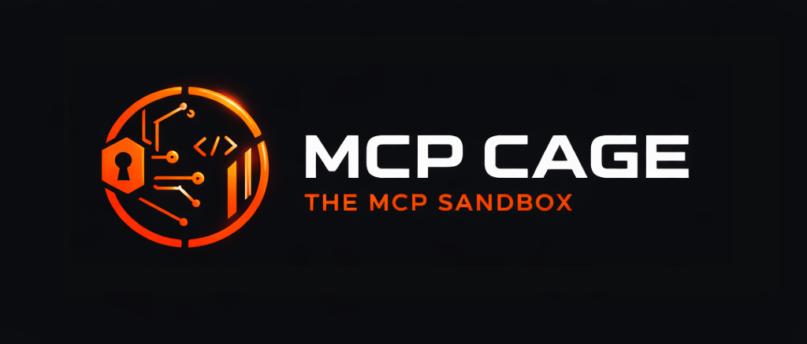

<p align="center">
  <h1 align="center">MCP Cage</h1>
  <p align="center">
    <em>The MCP Sandbox</em>
  </p>
  <p align="center">
    <strong>Run MCP servers without blindly trusting them.</strong>
  </p>
  <p align="center">
    <a href="https://github.com/mcp-hub-corp/mcp-cage/actions"></a>
    <a href="https://goreportcard.com/report/github.com/mcp-hub-corp/mcp-cage"></a>
    <a href="https://opensource.org/licenses/MIT"></a>
    <a href="go.mod"></a>
    <a href="https://github.com/mcp-hub-corp/mcp-cage/releases"></a>
    <a href="https://mcp-hub.info"></a>
  </p>
</p>

<p align="center">
  
</p>

**MCP Cage** is the execution sandbox for MCP servers — the runtime layer where security certifications become hard enforcement. It verifies integrity, confines processes, and audits everything, so you never have to blindly trust the code you run.

> **Project:** MCP Cage &nbsp;·&nbsp; **CLI command:** `smcp` (short for *Secure MCP*)

## Table of Contents

- [The Problem](#the-problem)
- [What MCP Cage Does](#what-mcp-cage-does)
- [The Sandbox](#the-sandbox)
- [Quick Start](#quick-start)
- [Installation](#installation)
- [Usage](#usage)
- [Configuration](#configuration)
- [LLM Security Warnings](#llm-security-warnings)
- [Platform Support](#platform-support)
- [Documentation](#documentation)
- [MCP Hub Platform](#mcp-hub-platform)
- [License](#license)
- [Contributing](#contributing)

## The Problem

Every time you run an MCP server, you are executing arbitrary code with your full system permissions:

```bash
uvx some-mcp-server       # What does this code actually do?
npx @someone/mcp-tool     # Can it read your SSH keys? Yes.
```

No verification. No resource limits. No sandboxing. No audit trail.

For individual developers experimenting locally, this may be acceptable. For teams and organizations running MCP servers connected to internal databases, APIs, credentials, and infrastructure — it is not. A compromised or malicious MCP server can exfiltrate secrets, exhaust system resources, spawn persistent processes, or pivot through your internal network, all with zero visibility.

The root cause is structural: the tools that run MCP servers (`uvx`, `npx`) were designed for convenience, not security. They have no mechanism for verifying what they are about to execute, no way to constrain what it does while running, and no record of what happened.

MCP Cage fixes this at the execution layer.

## What MCP Cage Does

MCP Cage ships as `smcp`, a drop-in replacement for `uvx` and `npx` that wraps every MCP server execution in a full security envelope:

| Capability | Without MCP Cage | With MCP Cage (`smcp`) |
|---|---|---|
| Integrity verification | None | SHA-256 on every artifact, every time |
| Security analysis | None | 14 vulnerability classes, cert levels 0–3 |
| Process sandboxing | None — full system access | CPU, memory, PID, and file descriptor limits |
| Network access | Unrestricted | Default-deny (Linux) |
| Filesystem access | Full access | Confined to working directory (Linux) |
| LLM awareness | None | Security warnings injected into MCP protocol |
| Secret handling | Visible in env/logs | Automatically redacted |
| Audit trail | None | Structured JSON logs, every execution |

Packages are analyzed upstream by [MCP Hub Platform](https://mcp-hub.info) for **14 classes of security vulnerabilities** and assigned a certification level (0–3) before they ever reach your machine. MCP Cage enforces those certifications at runtime: it validates digests, checks your organization's policy, applies the sandbox, and writes an immutable audit log — for every execution, without exception.

## The Sandbox

The sandbox is the core of MCP Cage. It is not an afterthought or a checkbox — it is the primary reason the project exists.

When `smcp run` executes an MCP server, it does not simply `exec` the process. It builds an isolation boundary around it:

**Resource limits** are always applied, on every platform, with no way to disable them. Every MCP server runs with a hard cap on CPU time, memory, open file descriptors, and child process count. A server that tries to consume all available memory, fork-bomb the system, or run indefinitely will be stopped.

**Filesystem isolation** (Linux) confines the process to its working directory using kernel-level Landlock LSM. The server cannot read `/etc/passwd`, your SSH keys, your environment files, or anything outside the directory it was given.

**Network isolation** (Linux) places the process in a new network namespace with no interfaces by default. Unless the MCP manifest explicitly declares network requirements, the server cannot make outbound connections.

**Subprocess control** restricts the server's ability to spawn child processes unless the manifest declares that permission.

**Secret redaction** ensures that tokens, passwords, and API keys passed to the server are never written to logs, stdout, or stderr at any verbosity level.

**Audit logging** writes a structured JSON record for every execution: start time, end time, exit code, duration, applied limits, package reference, and digest. There is no way to run an MCP server through MCP Cage without generating an audit entry.

The sandbox layers are additive. Linux gets the full stack. macOS and Windows get resource limits and audit logging today, with deeper isolation on the roadmap. Run `smcp doctor` to see exactly which layers are active on your system.

> For production workloads with untrusted MCP servers, Linux is the recommended platform. See [Platform Support](#platform-support) for details.

## Quick Start

```bash
# 1. Install
brew install mcp-hub-corp/tap/smcp          # macOS
sudo apt install smcp                        # Ubuntu/Debian

# 2. Check your system's sandbox capabilities
smcp doctor

# 3. Run a certified MCP server
smcp run acme/hello-world@1.2.3

# 4. Use it with Claude Desktop — replace uvx/npx in your config:
# "command": "smcp", "args": ["run", "--trust", "acme/tool@latest"]
```

## Installation

### Ubuntu / Debian

```bash
sudo add-apt-repository ppa:mcphub/smcp
sudo apt update
sudo apt install smcp
```

Supports Ubuntu Noble (24.04 LTS) and Jammy (22.04 LTS).

### macOS (Homebrew)

```bash
brew install mcp-hub-corp/tap/smcp
```

### Binary download

Download the latest release from [GitHub Releases](https://github.com/mcp-hub-corp/mcp-cage/releases/latest):

```bash
# macOS — Apple Silicon
curl -sSL https://github.com/mcp-hub-corp/mcp-cage/releases/latest/download/smcp_darwin_arm64.tar.gz | tar xz
sudo mv smcp /usr/local/bin/

# macOS — Intel
curl -sSL https://github.com/mcp-hub-corp/mcp-cage/releases/latest/download/smcp_darwin_amd64.tar.gz | tar xz
sudo mv smcp /usr/local/bin/

# Linux — amd64
curl -sSL https://github.com/mcp-hub-corp/mcp-cage/releases/latest/download/smcp_linux_amd64.tar.gz | tar xz
sudo mv smcp /usr/local/bin/

# Linux — arm64
curl -sSL https://github.com/mcp-hub-corp/mcp-cage/releases/latest/download/smcp_linux_arm64.tar.gz | tar xz
sudo mv smcp /usr/local/bin/
```

### From source

```bash
go install github.com/mcp-hub-corp/mcp-cage/cmd/smcp@latest
```

### Verify your installation

```bash
smcp --version
smcp doctor     # reports which sandbox features are active on your system
```

## Usage

### Running MCP servers

```bash
# Run by version
smcp run acme/hello-world@1.2.3

# Run latest published version
smcp run acme/tool@latest

# Run by exact digest (fully immutable — guaranteed bit-for-bit identity)
smcp run acme/tool@sha256:a1b2c3...

# Pre-download for offline use or CI/CD pipelines
smcp pull acme/tool@1.2.3

# Inspect a package before running it
smcp info acme/tool@1.2.3
```

### Cache management

```bash
smcp cache ls           # list cached artifacts
smcp cache rm --all     # clear the entire cache
```

### Authentication

```bash
smcp login --token YOUR_TOKEN
# or via environment variable
export MCP_REGISTRY_TOKEN=YOUR_TOKEN
```

### All commands

| Command | Description |
|---|---|
| `smcp run <ref>` | Execute an MCP server from a package reference |
| `smcp pull <ref>` | Download a package without executing it |
| `smcp info <ref>` | Display package manifest and certification details |
| `smcp login` | Authenticate with the registry |
| `smcp logout` | Remove stored credentials |
| `smcp cache ls` | List cached artifacts |
| `smcp cache rm` | Remove cached artifacts |
| `smcp doctor` | Diagnose sandbox capabilities on this system |

## Configuration

Create `~/.smcp/config.yaml` to set persistent defaults:

```yaml
registry_url: "https://registry.mcp-hub.info"
timeout: 5m
max_memory: "512M"
max_cpu: 1000              # millicores — 1000 = 1 full core

audit_enabled: true
audit_log_file: "~/.smcp/audit.log"

policy:
  min_cert_level: 1        # 0 = any, 1 = static verified, 2 = security certified
  cert_level_mode: strict  # strict | warn | disabled
  allowed_origins:
    - official
    - verified
```

CLI flags take precedence over the config file. Environment variables use the `MCP_` prefix — for example, `MCP_REGISTRY_URL`, `MCP_CACHE_DIR`, `MCP_LOG_LEVEL`.

## LLM Security Warnings

When AI assistants like Claude Desktop, Cursor, or Windsurf run MCP servers, the human user never sees the terminal. If an MCP server has a low security score, there is ordinarily no way for the user to know.

MCP Cage solves this by injecting security warnings directly into the MCP protocol handshake. Replace `uvx`/`npx` with `smcp run --trust` in your AI client configuration:

```json
{
  "mcpServers": {
    "data-tool": {
      "command": "smcp",
      "args": ["run", "--trust", "acme/data-tool@latest"]
    }
  }
}
```

If `acme/data-tool` scores below the warning threshold (default: 80), `smcp` intercepts the MCP `initialize` handshake and:

1. Prepends a security warning to the `instructions` field — the AI reads it and surfaces it to the user
2. Sends a `notifications/message` at level `warning` — displayed as a UI banner in supporting clients

After the handshake (typically 3–4 messages), the proxy switches to raw passthrough with zero overhead.

```bash
# Adjust the threshold
smcp run --trust --warning-threshold 60 acme/tool@latest
```

Set `policy.warning_threshold: 80` in `~/.smcp/config.yaml` to make this permanent.

## Platform Support

The depth of sandboxing depends on the operating system. Linux provides the full isolation stack; macOS and Windows have partial support today.

| Capability | Linux | macOS | Windows |
|---|:---:|:---:|:---:|
| Resource limits (CPU, memory, PIDs, FDs) | cgroups v2 + rlimits | rlimits | Job Objects |
| Network isolation | kernel namespaces | — | — |
| Filesystem isolation | Landlock LSM | — | — |
| Subprocess control | seccomp | limited | — |
| Audit logging | full | full | full |
| **Production ready** | **Yes** | No | No |

Run `smcp doctor` to see the exact status on your machine.

**Sandbox documentation by platform:**

- [Linux sandbox](./docs/LINUX_SANDBOX.md) — cgroups v2, network namespaces, Landlock, seccomp, rlimits
- [macOS sandbox](./docs/MACOS_SANDBOX.md) — rlimits, Seatbelt/sandbox-exec, known limitations
- [Windows sandbox](./docs/WINDOWS_SANDBOX.md) — Job Objects, known limitations

> macOS and Windows have confirmed sandbox bypass vulnerabilities (child processes escape resource limits). See [Security Sandbox Limitations](./docs/SECURITY_SANDBOX_LIMITATIONS.md) for full technical details, mitigations, and the production deployment recommendation (Linux or Docker).

## Documentation

| Document | Description |
|---|---|
| [Architecture overview](./docs/OVERVIEW.md) | How the components fit together |
| [Security model](./docs/SECURITY.md) | Threat model, invariants, and known limitations |
| [Linux sandbox](./docs/LINUX_SANDBOX.md) | Full isolation stack: cgroups, namespaces, Landlock, seccomp |
| [macOS sandbox](./docs/MACOS_SANDBOX.md) | Current implementation, known bugs, roadmap |
| [Windows sandbox](./docs/WINDOWS_SANDBOX.md) | Job Objects, current limitations, roadmap |
| [Security limitations](./docs/SECURITY_SANDBOX_LIMITATIONS.md) | Confirmed vulnerabilities, mitigations, production guidance |
| [Examples](./docs/EXAMPLES.md) | Usage patterns, CI/CD integration, policy examples |
| [Config reference](./docs/config.example.yaml) | All configuration options with descriptions |
| [Contributing](./CONTRIBUTING.md) | Development setup, code style, pull request process |

## MCP Hub Platform

<p align="center">
  <a href="https://mcp-hub.info">
    
  </a>
</p>

MCP Cage is the execution plane of **[MCP Hub Platform](https://mcp-hub.info)** — a complete trust infrastructure for publishing, certifying, and running MCP servers in a predictable, auditable, and governable way.

The platform is a pipeline of four components that work together end to end:

```
Developer
    │  smcp push / git commit
    ▼
[mcp-hub]  ── ANALYZE job ──▶  [mcp-scan]
    │                               │
    │  ◀── ANALYZE_COMPLETE ────────┘
    │
    │  publishes certified artifact
    ▼
[mcp-registry]  ── content-addressed storage (SHA-256)
    ▲
    │  resolve → validate → sandbox → audit
    │
[mcp-cage]  ◀── you are here
```

| Component | Role | Description |
|---|---|---|
| **[mcp-hub](https://mcp-hub.info)** | Control Plane | Web dashboard and certification engine. Ingests MCP servers, orchestrates security analysis, computes scores, publishes certified artifacts. Manages orgs, billing, and enterprise governance. |
| **mcp-scan** | Analysis Engine | Static security analyzer for MCP servers. Detects 14 vulnerability classes (injection, exfiltration, privilege escalation, resource abuse, and more) across Python, TypeScript, JavaScript, and Go. |
| **mcp-registry** | Data Plane | Artifact distribution service with content-addressed storage (SHA-256). Serves certified MCP bundles with JWT auth and scope-based authorization. |
| **mcp-cage** | Execution Plane | This repository. The last mile of the pipeline — where all upstream certification materializes as runtime enforcement. |

MCP Cage is where trust becomes real. The hub can analyze, score, and certify all it wants — but none of that matters if the execution layer does not validate digests, enforce policies, sandbox processes, and log everything. This project is responsible for the runtime half of the platform's security guarantees.

To publish MCP servers, manage certifications, or set organization-wide policies, visit **[mcp-hub.info](https://mcp-hub.info)**.

## License

MCP Cage is released under the **MIT License**.

This means you are free to use, copy, modify, merge, publish, distribute, sublicense, and sell copies of the software, for any purpose, commercial or non-commercial, with or without attribution. The only requirement is that the license and copyright notice are included with any substantial copy of the software.

See the full license text in [`LICENSE`](./LICENSE).

The MIT license was chosen deliberately: MCP Cage is an execution-layer security tool, and its value comes from wide adoption. Restrictive licensing would work against that goal.

## Contributing

Contributions are welcome. See [CONTRIBUTING.md](./CONTRIBUTING.md) for the development setup, code style guidelines, and pull request process.

For security issues, please follow the responsible disclosure process in [SECURITY.md](./SECURITY.md) rather than opening a public issue.
